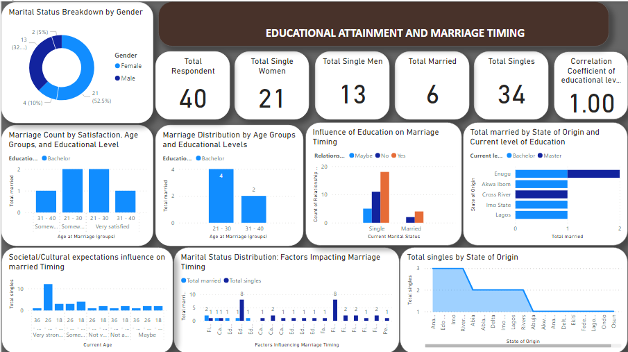

# Educational-Attainment-and-Marriage-Timing

## INTRODUCTION

This Power BI analysis, titled **Educational Attainment and Marriage Timing** delves into the intricate relationship between education and the timing of marriage. By leveraging data collected from a diverse range of participants, this project aims to unravel key insights that shed light on how educational attainment influences the timing of marriage among individuals.
The dataset used in this analysis encompasses responses from participants spanning various demographics, including age, gender, educational background, and geographic location.

## PROBLEM STATEMENT

1. What is the distribution of the married and single population according to gender?
2. How does the age of marriage correlate with educational attainment?
3. What is the satisfaction level regarding the timing of marriage among different age groups and educational backgrounds?
4. How do societal and cultural expectations influence the timing of marriage across different age groups?
5. Which states have the highest number of single and married individuals?
6. What is the correlation between educational level and timing of marriage, as revealed by Power BI analysis?
7. How is the correlation coefficient interpreted in the context of age at marriage and educational level?
9. What are the main conclusions drawn from the analysis regarding marital dynamics, age at marriage, and educational attainment? 

## SKILLS AND CONCEPTS COVERED

The following power Bi features were incorporated:
- DAX
- Measure
- Quick Measure
- Page Navigation
- Filters 

## MODELLING

No modelling was required since we need just a table for the analysis

## VISUALIZATION

This report comprises of 4 pages:
- Educational attainment and marriage timing dashboard
- Conclusion and summary
- Recommendation

## SUMMARY

1. **Marital Population Distribution:** The study reveals that 15% of the population is married, with the majority being between ages 21-30 and 31-40, especially among Bachelor's degree holders.

2. **Age of Marriage and Education:** Individuals with Bachelor's degrees tend to marry more frequently within the 21-30 and 31-40 age groups, indicating a correlation between educational attainment and marriage timing.

3. **Satisfaction and Timing of Marriage:** Bachelor's degree holders generally express satisfaction with the timing of their marriage, particularly in the 31-40 age group.

4. **Influence of Education on Marriage Timing:** There's acknowledgment among single and married individuals of the impact of educational background on marriage timing, with varying degrees of agreement observed.

5. **Highest Number of Single and Married by State of Origin:** Certain states, like Anambra and Enugu, stand out with the highest numbers of single and married individuals, respectively.

6. **Societal/Cultural Expectations Influence on Marriage Timing:** Data suggests a strong acknowledgment of societal and cultural expectations influencing marriage timing, particularly among younger age groups.

7. **Correlation Analysis in Power BI:** Power BI analysis reveals a perfect positive linear relationship between educational level and the timing of marriage within each gender category.

8. **Interpretation of Correlation:** The correlation coefficient of 1.00 signifies that as educational level increases, the time of marriage also increases proportionally, indicating a consistent trend across genders.

- **Caution:** While correlation is observed, it does not imply causation, and other factors may contribute to the relationship between education and marriage timing.

## CONCLUSION 

The analysis provides valuable insights into marital dynamics and their connection to educational attainment, emphasizing the prevalence of marriage within specific age groups and the influence of education on marriage timing.

## RECOMMENDATION

- **Educational Awareness Programs:**  Initiate programs emphasizing the importance of completing a Bachelor's degree for informed decision-making regarding marriage timing.

- **Career Development Support:** Implement assistance programs focusing on career development to empower individuals in making well-informed decisions about marriage timing.

- **Counseling Services:** Create counseling services to help individuals navigate the relationship between education and marriage timing.

- **Community Engagement:** Foster open discussions to empower individuals to make decisions about marriage aligned with personal values and aspirations.

- **Targeted Programs for Specific States:** Implement tailored programs considering cultural and demographic nuances to address marriage timing in specific states.

- **Workplace Flexibility:** Support workplace policies offering flexibility for individuals balancing higher education and career responsibilities, reducing conflicts in managing both.

- **Peer Support Networks:** Establish networks for individuals to connect and share experiences regarding education and marriage decisions.

- **Parental and Family Education:** Develop materials or programs to enhance family awareness of how education impacts marriage timing.

- **Policy Advocacy:** Advocate for flexible policies that respect diverse individual choices regarding education and marriage.

- **Further Research:** Conduct qualitative research to explore individual narratives and experiences related to education and marriage timing correlation.

You can interact with the report here [Power BI Service](https://app.powerbi.com/groups/ab4dee02-64d2-46c9-9172-d5d2d6a15157/reports/432d0120-843a-4266-a326-0fb3f087f1a4/ReportSection?experience=power-bi)

## REFERENCE

The recommendations provided in this repository are derived from data collected through a survey conducted using Microsoft Forms. 

[DaxStudio](https://daxstudio.org/docs/tutorials/writing-dax-queries)
DAX Studio documentation was referenced to assist in the analysis of the collected data. 

The survey was designed and executed by **Onyeachu Favour Amarachi** with the goal of gathering insights into **Educational Attainment and Marriage Timing**.

